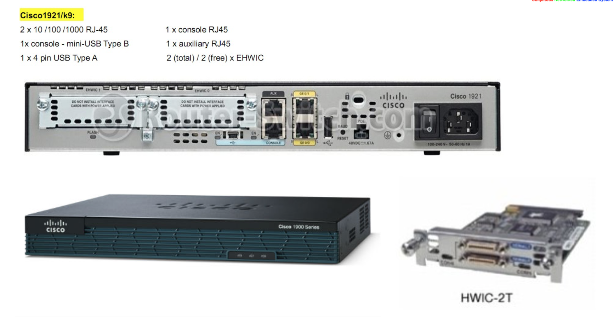
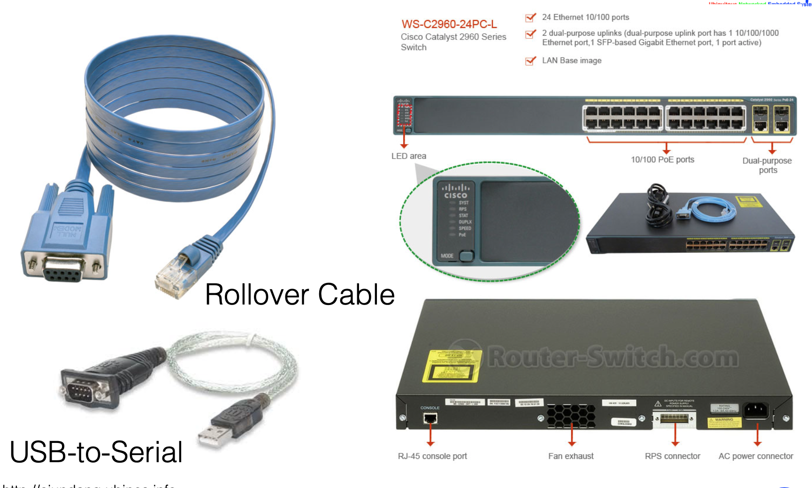
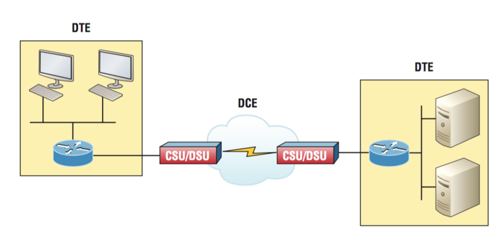
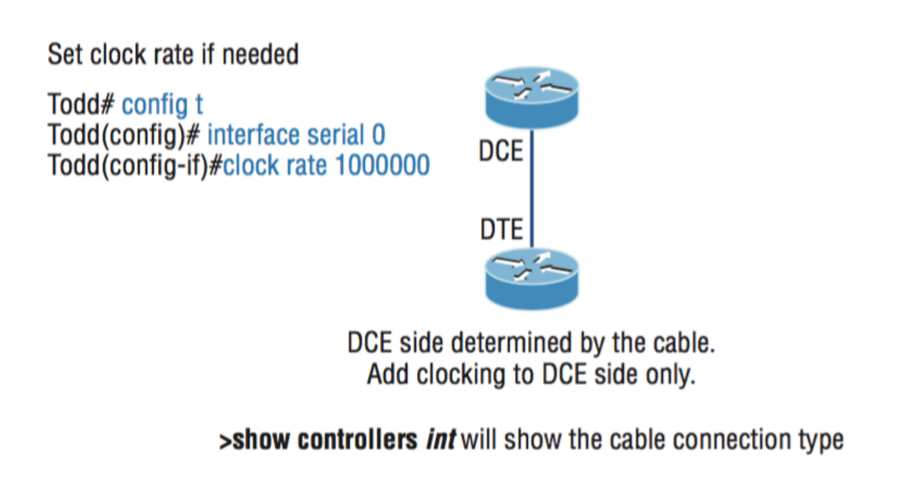
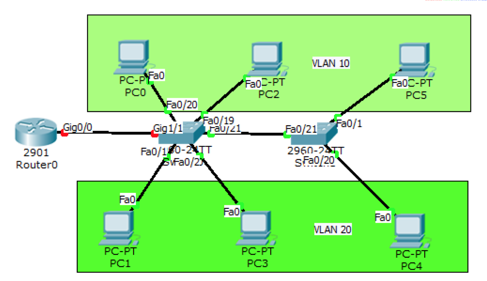

# Internet Technology Workshop
## __Topics__
1. [Computer Network Design](#computer-network-design)
1. Protocol Analysis
1. Network Architecture with docker

## __Computer Network Design__ [[Up]](#topics)
### __CISCO Devices__

__CISCO Rotuer 1900__




__Switch Catalyst 2960__




### __CISCO Command__
#### __1. Basic IOS Command__
1. After router reboot, user in user exec mode gets prompt
```
Router>
```
2. Change mode to priviledge mode
```
Router> enable
```
Then, prompt is changed to Router# 

3. Change mode to user mode with command 
```
Router# disable
```
4. Logout from devices
```
Router> logout 
```

5. Help in IOS
```
Router> ?
Router# c?
Router# show ?
```

6. Set hostname
```
Router# configure terminal 
Enter configuration commands, one per line.  End with CNTL/Z.
Router(config)# hostname Gateway
Gateway(config)# exit
Gateway#
```

7. Set Banner
```
Gateway# configure terminal 
Enter configuration commands, one per line.  End with CNTL/Z.
Gateway(config)# banner motd $
Enter TEXT message.  End with the character '$'.
================================================
# Admin Email: cjundang@gmail.com              #
# Tel No.: 075672209                           #
================================================
$
```

8. Logout from switch and login again
```
Gateway(config)# exit
Gateway#
%SYS-5-CONFIG_I: Configured from console by console
Gateway# exit
Gateway con0 is now available

Press RETURN to get started.

================================================
# Admin Email: cjundang@gmail.com              #
# Tel No.: 075672209                           #
================================================

Gateway>
```
9. Password, to set login password for devices
```
Gateway> enable
Gateway# configure terminal 
Enter configuration commands, one per line.  End with CNTL/Z.
Gateway(config)# line console 0
Gateway(config-line)# password cisco  , for this case, password is "cisco"
Gateway(config-line)# login
Gateway(config-line)# exit
Gateway(config)# exit
Gateway# exit
```
test, logout and login again
```
User Access Verification

Password: <cisco>

Gateway>
```

10. Priviledge password
```
Gateway> enable 
Gateway# configure terminal 
Enter configuration commands, one per line.  End with CNTL/Z. 
Gateway(config)# enable secret cisco 
Gateway(config)# exit 
Gateway# 
%SYS-5-CONFIG_I: Configured from console by console 
Gateway# exit
```

test, 
```
Gateway> 
Gateway> enable Password: <cisco> 
Gateway#
```

#### __2. IOS Interfaces__






1. Interfaces of switch,
```
Switch# show ip interface brief 
Interface              IP-Address      OK? Method Status                Protocol 
FastEthernet0/1        unassigned      YES manual down                  down 
FastEthernet0/2        unassigned      YES manual down                  down 
FastEthernet0/3        unassigned      YES manual down                  down 
FastEthernet0/4        unassigned      YES manual down                  down 
FastEthernet0/5        unassigned      YES manual down                  down 
FastEthernet0/6        unassigned      YES manual down                  down 
FastEthernet0/7        unassigned      YES manual down                  down 
```
2. Interface of router, 
```
Router#show ip interface brief 
Interface              IP-Address      OK? Method Status                Protocol 
GigabitEthernet0/0     unassigned      YES unset  administratively down down 
GigabitEthernet0/1     unassigned      YES unset  administratively down down 
Serial0/0/0            unassigned      YES unset  administratively down down 
Serial0/0/1            unassigned      YES unset  administratively down down 
Vlan1                  unassigned      YES unset  administratively down down
```

3. IOS Interface,
```
Switch# show interfaces fastEthernet 0/1
FastEthernet0/1 is down, line protocol is down (disabled)
  Hardware is Lance, address is 0000.0c7b.5201 (bia 0000.0c7b.5201)
 BW 100000 Kbit, DLY 1000 usec,
     reliability 255/255, txload 1/255, rxload 1/255
  Encapsulation ARPA, loopback not set
  Keepalive set (10 sec)
  Half-duplex, 100Mb/s
  input flow-control is off, output flow-control is off
  ARP type: ARPA, ARP Timeout 04:00:00
  Last input 00:00:08, output 00:00:05, output hang never
  Last clearing of "show interface" counters never
  Input queue: 0/75/0/0 (size/max/drops/flushes); Total output drops: 0
  Queueing strategy: fifo
  Output queue :0/40 (size/max)
  5 minute input rate 0 bits/sec, 0 packets/sec
  5 minute output rate 0 bits/sec, 0 packets/sec
     956 packets input, 193351 bytes, 0 no buffer
     Received 956 broadcasts, 0 runts, 0 giants, 0 throttles
     0 input errors, 0 CRC, 0 frame, 0 overrun, 0 ignored, 0 abort
     0 watchdog, 0 multicast, 0 pause input
     0 input packets with dribble condition detected
     2357 packets output, 263570 bytes, 0 underruns
```

4. Connect computer at port fa0/1, then check port status again
```
Switch# show interfaces fastEthernet 0/1
FastEthernet0/1 is up, line protocol is up (connected)
```

5. Configure IP address to interface,
```
Router>enable 
Router#show ip interface brief 
Interface              IP-Address      OK? Method Status                Protocol 
GigabitEthernet0/0     unassigned      YES unset  administratively down down 
GigabitEthernet0/1     unassigned      YES unset  administratively down down 
Serial0/0/0            unassigned      YES unset  administratively down down 
Serial0/0/1            unassigned      YES unset  administratively down down 
Vlan1                  unassigned      YES unset  administratively down down

Router#configure 
Configuring from terminal, memory, or network [terminal]? 
Enter configuration commands, one per line.  End with CNTL/Z.
Router(config)#interface gigabitEthernet 0/0
Router(config-if)#ip address 10.0.1.1 255.255.255.0
Router(config-if)#no shutdown 

%LINK-5-CHANGED: Interface GigabitEthernet0/0, changed state to up
%LINEPROTO-5-UPDOWN: Line protocol on Interface GigabitEthernet0/0, changed state to up
Router(config-if)#exit
Router(config)#exit

Router#sh ip interface brief 
Interface              IP-Address      OK? Method Status                Protocol 
GigabitEthernet0/0     10.0.1.1        YES manual up                    up 
GigabitEthernet0/1     unassigned      YES unset  administratively down down 
Serial0/0/0            unassigned      YES unset  administratively down down 
Serial0/0/1            unassigned      YES unset  administratively down down 
Vlan1                  unassigned      YES unset  administratively down down
```

6. Set IP addess to serial interface. Connect two 1900 routers with serial cable at serial0/0/0 for both router. Then assign two rouers named Router1 and Router2,

(At router1)
```
Router#configure 
Configuring from terminal, memory, or network [terminal]? 
Enter configuration commands, one per line.  End with CNTL/Z.
Router(config)#hostname Router1
Router1(config)#exit

Router1#show controllers serial 0/0/0
Interface Serial0/0/0
Hardware is PowerQUICC MPC860
DCE V.35, clock rate 2000000
```
(At router2)
```
Router#configure 
Configuring from terminal, memory, or network [terminal]? 
Enter configuration commands, one per line.  End with CNTL/Z.
Router(config)#hostname Router2
Router2(config)#exit

Router2#show controllers serial 0/0/0
Interface Serial0/0/0
Hardware is PowerQUICC MPC860
DTE V.35 TX and RX clocks detected
```
Whitch one is DCE router?________________________

7. Set IP address and clock rate to DCE, in this case, set up in Router1

```
Router1#configure 
Configuring from terminal, memory, or network [terminal]? 
Enter configuration commands, one per line.  End with CNTL/Z.
Router1(config)#interface serial 0/0/0
Router1(config-if)#ip address 202.28.68.1 255.255.255.252
Router1(config-if)#clock rate 148000 
Router1(config-if)#no shutdown 
%LINK-5-CHANGED: Interface Serial0/0/0, changed state to down
Router1(config-if)#
```

8. Set another router as 202.28.68.2/30 at serial 0/0/0
```
Router2#configure 
Configuring from terminal, memory, or network [terminal]? 
Enter configuration commands, one per line.  End with CNTL/Z.
Router2(config)#interface serial 0/0/0
Router2(config-if)#ip address 202.28.68.2 255.255.255.252
Router2(config-if)#no shutdown 

%LINK-5-CHANGED: Interface Serial0/0/0, changed state to up
%LINEPROTO-5-UPDOWN: Line protocol on Interface Serial0/0/0, changed state to up
```

9. Check interface status in Router1 and Router2,
```
Router1#show ip interface brief 
Interface              IP-Address      OK? Method Status                Protocol 
GigabitEthernet0/0     10.0.1.1        YES manual up                    up 
GigabitEthernet0/1     unassigned      YES unset  administratively down down 
Serial0/0/0            202.28.68.1     YES manual up                    up 
Serial0/0/1            unassigned      YES unset  administratively down down 
Vlan1                  unassigned      YES unset  administratively down down

Router2#show ip interface brief 
Interface              IP-Address      OK? Method Status                Protocol 
GigabitEthernet0/0     unassigned      YES unset  administratively down down 
GigabitEthernet0/1     unassigned      YES unset  administratively down down 
Serial0/0/0            202.28.68.2     YES manual up                    up 
Serial0/0/1            unassigned      YES unset  administratively down down 
Vlan1                  unassigned      YES unset  administratively down down
Router2#
```

10. Save configuration for next reboot,

11. To show current running congfigure file,
```
Router1#show running-config 
Building configuration...

Current configuration : 773 bytes
!
version 15.1
no service timestamps log datetime msec
no service timestamps debug datetime msec
no service password-encryption
!
hostname Router1
!

To show current startup congfigure file,
Router1#show startup-config 
startup-config is not present

To save current running file as startup file,
Router1#copy running-config startup-config 
Destination filename [startup-config]? 
Building configuration...
[OK]

Show startup file again,
Router1#sh startup-config 
Using 773 bytes
!
version 15.1
no service timestamps log datetime msec
no service timestamps debug datetime msec
no service password-encryption
!
hostname Router1
!
!
```

#### __3. Switch__

1. Access CLI console via serial port in PC0
2. Set IP address to PC1 with 10.0.2.2/24
3. Set IP address 10.0.2.1/24 to VLAN1 in switch

To set ip address
```
Switch>enable 
Switch#configure t
Enter configuration commands, one per line.  End with CNTL/Z.
Switch(config)#int vlan1
Switch(config-if)#ip address 10.0.2.1 255.255.255.0
Switch(config-if)#no shutdown 
%LINK-5-CHANGED: Interface Vlan1, changed state to up
%LINEPROTO-5-UPDOWN: Line protocol on Interface Vlan1, changed state to up
```

4. To set password for remote access,
```
Switch(config-if)#line vty 0 4
Switch(config-line)#password cisco
Switch(config-line)#login
Switch(config-line)#exit
Switch(config)#enable secret cisco
Switch(config)#exit
Switch#
%SYS-5-CONFIG_I: Configured from console by console
```
5. (PC1) access to switch via telent command
```
C:\>  telnet 10.0.2.1
Trying 10.0.2.1... Open

User Access Verification
Password: <cisco>
Switch>
```

6. To configure a single port in switch
```
Switch#configure 
Configuring from terminal, memory, or network [terminal]? 
Enter configuration commands, one per line.  End with CNTL/Z.
Switch(config)#interface fastEthernet 0/1
Switch(config-if)#speed auto
Switch(config-if)#duplex auto 
Switch(config-if)#no shutdown 
Switch(config-if)#end
```
7. To configure set of port in switch
```
Switch#configure 
Configuring from terminal, memory, or network [terminal]? 
Enter configuration commands, one per line.  End with CNTL/Z.
Switch(config)#interface range fastEthernet 0/2-24
Switch(config-if-range)#duplex auto 
Switch(config-if-range)#speed auto 
Switch(config-if-range)#no shutdown 
Switch(config-if-range)#end
Switch#
```

8. Save configuration
```
Switch# copy run start
```

### __Packet Tracer__


### __Network Devices Configuration__


#### __1. VLAN__

0. All computers can connect togerther.

Scenarios,
There are 2 VLAN named Admin, programmer.
VLAN named admin is assigned to fast0/1-9, whereas VLAN named programmer is assigned to fast0/10-19

1. Show current VLANs
```
Switch1#show vlan

VLAN Name                             Status    Ports
---- -------------------------------- --------- -------------------------------
1    default                          active    Fa0/1, Fa0/2, Fa0/3, Fa0/4
                                                Fa0/5, Fa0/6, Fa0/7, Fa0/8
                                                Fa0/9, Fa0/10, Fa0/11, Fa0/12
                                                Fa0/13, Fa0/14, Fa0/15, Fa0/16
                                                Fa0/17, Fa0/18, Fa0/19, Fa0/20
                                                Fa0/21, Fa0/22, Fa0/23, Fa0/24
                                                Gig0/1, Gig0/2
1002 fddi-default                     act/unsup 
1003 token-ring-default               act/unsup 
1004 fddinet-default                  act/unsup 
1005 trnet-default                    act/unsup 
```
2. Create 2 VLANs
```
Switch1#configure 
Configuring from terminal, memory, or network [terminal]? 
Enter configuration commands, one per line.  End with CNTL/Z.
Switch1(config)#vlan 10
Switch1(config-vlan)#name admin
Switch1(config-vlan)#exit
Switch1(config)#vlan 20
Switch1(config-vlan)#name programmer
Switch1(config-vlan)#exit
Switch1(config)#
Switch1(config)#exit
```

3. Show current VLANs
```
Switch1#show vlan

VLAN Name                             Status    Ports
---- -------------------------------- --------- -------------------------------
1    default                          active    Fa0/1, Fa0/2, Fa0/3, Fa0/4
                                                Fa0/5, Fa0/6, Fa0/7, Fa0/8
                                                Fa0/9, Fa0/10, Fa0/11, Fa0/12
                                                Fa0/13, Fa0/14, Fa0/15, Fa0/16
                                                Fa0/17, Fa0/18, Fa0/19, Fa0/20
                                                Fa0/21, Fa0/22, Fa0/23, Fa0/24
                                                Gig0/1, Gig0/2
10   admin                            active    
20   programmer                       active    
1002 fddi-default                     act/unsup 
1003 token-ring-default               act/unsup 
1004 fddinet-default                  act/unsup 
1005 trnet-default                    act/unsup 
```

4. Assigned ports fast0/1-9 to VLAN
```
Switch1#configure 
Configuring from terminal, memory, or network [terminal]? 
Enter configuration commands, one per line.  End with CNTL/Z.
Switch1(config)#interface range fastEthernet 0/1-9
Switch1(config-if-range)#switchport mode access 
Switch1(config-if-range)#switchport access vlan 10
Switch1(config-if-range)#no shutdown 
Switch1(config-if-range)#exit
5. Show VLAN
Switch# sh vlan
```
6. Test ping
```
10.0.0.1 --> 10.0.0.2
10.0.0.1 --> 10.0.0.3
10.0.0.2 --> 10.0.0.1
```
7. Assigned ports fast0/10-19 to VLAN
```
Switch1(config)#interface range fastEthernet 0/10-19
Switch1(config-if-range)#switchport mode access 
Switch1(config-if-range)#switchport access vlan 20
Switch1(config-if-range)#no shutdown 
Switch1(config-if-range)#end
```

8. Show VLAN
```
Switch# sh vlan
```

9. Test ping


#### __2. VLAN over Trunk__

Objectives: 
- PC1 & PC3 are in VLAN 10 while PC0 & PC2 are in VLAN 20
- Switch1 & 2 are connected via gig0/0
- VLAN 10 is assigned for fast0/1-10 of both Switches.
- VLAN 20 is assigned for fast0/11-20 for both Switches.

This lab start form all PCs are connected and successfully ping together.





1. Change switch's hostname to Switch1 & switch2

(Switch1)
```
Switch>ena
Switch#configure 
Configuring from terminal, memory, or network [terminal]? 
Enter configuration commands, one per line.  End with CNTL/Z.
Switch(config)#hostname Switch1
Switch1(config)# exit
```

2. Assigned all interfaces are access mode (set both Switch1* Switch2)
```
(Switch1)
Switch1#configure 
Configuring from terminal, memory, or network [terminal]? 
Enter configuration commands, one per line.  End with CNTL/Z.
Switch1(config)#interface range fastEthernet 0/1-24
Switch1(config-if-range)#switchport mode access
Switch1(config-if-range)#exit
Switch1(config)#exit
Switch1#
```

3. Create VLAN 10 and 20 in switch1 & switch2

(Switch1)
```
Switch1#configure 
Configuring from terminal, memory, or network [terminal]? 
Enter configuration commands, one per line.  End with CNTL/Z.
Switch1(config)#vlan 10
Switch1(config-vlan)#exit
Switch1(config)#vlan 20
Switch1(config-vlan)#
Switch1(config-vlan)#exit
Switch1(config)#exit
```

To show vlan status, 
```
Switch1# sh vlan
VLAN Name                             Status    Ports
---- -------------------------------- --------- -------------------------------
1    default                          active    Fa0/1, Fa0/2, Fa0/3, Fa0/4
                                                Fa0/5, Fa0/6, Fa0/7, Fa0/8
                                                Fa0/9, Fa0/10, Fa0/11, Fa0/12
                                                Fa0/13, Fa0/14, Fa0/15, Fa0/16
                                                Fa0/17, Fa0/18, Fa0/19, Fa0/20
                                                Fa0/21, Fa0/22, Fa0/23, Fa0/24
                                                Gig0/1, Gig0/2
10   VLAN0010                         active    
20   VLAN0020                         active    
```

4. Assigned fast0/1-10 to VLAN 10, fast11-20 to VLAN20 in both switch

(Switch1)
```
Switch1#configure 
Configuring from terminal, memory, or network [terminal]? 
Enter configuration commands, one per line.  End with CNTL/Z.
Switch1(config)#interface range fastEthernet 0/1-10
Switch1(config-if-range)#switchport access vlan 10
Switch1(config-if-range)#exit
Switch1(config)#interface range fastEthernet 0/11-20
Switch1(config-if-range)#switchport access vlan 20
Switch1(config-if-range)#
```
Show vlan again, 
```
Switch1#sh vlan
VLAN Name                             Status    Ports
---- -------------------------------- --------- -------------------------------
1    default                          active    Fa0/21, Fa0/22, Fa0/23, Fa0/24
                                                Gig0/1, Gig0/2
10   VLAN0010                         active    Fa0/1, Fa0/2, Fa0/3, Fa0/4
                                                Fa0/5, Fa0/6, Fa0/7, Fa0/8
                                                Fa0/9, Fa0/10
20   VLAN0020                         active    Fa0/11, Fa0/12, Fa0/13, Fa0/14
                                                Fa0/15, Fa0/16, Fa0/17, Fa0/18
                                                Fa0/19, Fa0/20
```
5. Ping test
6. Create TRUNK in gig0/1 for both switches 

(Switch1)
```
Switch1#configure 
Configuring from terminal, memory, or network [terminal]? 
Enter configuration commands, one per line.  End with CNTL/Z.
Switch1(config)#interface gigabitEthernet 0/1
Switch1(config-if)#switchport mode trunk 
```
-- In packet tracer cannnot run this command
```
Switch1(config-if)#switchport trunk encapsulation dot1q 
```

7. Ping test
8. Show trunk status

(switch1)
```
Switch1#sh interfaces trunk 
Port        Mode         Encapsulation  Status        Native vlan
Gig0/1      on           802.1q         trunking      1

Port        Vlans allowed on trunk
Gig0/1      1-1005

Port        Vlans allowed and active in management domain
Gig0/1      1,10,20

Port        Vlans in spanning tree forwarding state and not pruned
Gig0/1      1,10,20
```

9. Allow only vlan 10's frames are sent over trunk
```
Switch1#configure 
Configuring from terminal, memory, or network [terminal]? 
Enter configuration commands, one per line.  End with CNTL/Z.
Switch1(config)#interface gigabitEthernet 0/1
Switch1(config-if)#switchport trunk allowed vlan 10
Switch1(config-if)#exit
Switch1(config)#exit
Switch1#
```
10. Show trunk status and ping test
```
Switch1#show interfaces trunk 
Port        Mode         Encapsulation  Status        Native vlan
Gig0/1      on           802.1q         trunking      1

Port        Vlans allowed on trunk
Gig0/1      10

Port        Vlans allowed and active in management domain
Gig0/1      10

Port        Vlans in spanning tree forwarding state and not pruned
Gig0/1      none
```

#### __3. Statics Route__

Simple routing,
1. Set IP Address for all devices
```
    PC0 -> 10.0.1.2/24
    PC1 -> 20.0.1.2/24
    Router 
        gig0/0 -> 10.0.1.1/24
        gig0/1 -> 20.0.1.1/24
```
```
(Router)
Router>enable 
Router#configure 
Configuring from terminal, memory, or network [terminal]? 
Enter configuration commands, one per line.  End with CNTL/Z.
Router(config)#interface gigabitEthernet 0/0
Router(config-if)#ip address 10.0.1.1 255.255.255.0
Router(config-if)#no shutdown 
Router(config-if)#exit

Router(config)#interface gigabitEthernet 0/1
Router(config-if)#ip address 20.0.1.1 255.255.255.0
Router(config-if)#no shutdown 
Router(config-if)#exit
Router(config)#exit

Router#sh ip interface brief 
Interface              IP-Address      OK? Method Status                Protocol 
GigabitEthernet0/0     10.0.1.1        YES manual up                    up 
GigabitEthernet0/1     20.0.1.1        YES manual up                    up 
Vlan1                  unassigned      YES unset  administratively down down
Router#
```

2. (PC0) Ping test
```
C:\> ping 10.0.1.1
C:\> ping 20.0.1.1
C:\> ping 20.0.1.2
```

Discuss result?


3. Set gateway, 10.0.1.1 for PC0, then ping test again
```
C:\> ping 10.0.1.1
C:\> ping 20.0.1.1
C:\> ping 20.0.1.2
```
Discuss result?

3. Set gateway, 20.0.1.1 for PC1, then ping test again
```
C:\> ping 10.0.1.1
C:\> ping 20.0.1.1
C:\> ping 20.0.1.2
```
Discuss result?

Two Routers,
4. Assign hostname named Router2 and Router2 to Router2 and Router3

(router2)
```
Router>enable
Router#configure 
Configuring from terminal, memory, or network [terminal]? 
Enter configuration commands, one per line.  End with CNTL/Z.
Router(config)#hostname Router2
Router2(config)#exit
```
(router3)
```
Router>enable
Router#configure 
Configuring from terminal, memory, or network [terminal]? 
Enter configuration commands, one per line.  End with CNTL/Z.
Router(config)#hostname Router3
Router3(config)#exit
```
5. Assign IP address to gig0/0 of router2. For router3, please asssign with yourself.

(router2)
```
Router2#configure 
Configuring from terminal, memory, or network [terminal]? 
Enter configuration commands, one per line.  End with CNTL/Z.

Router2(config)#interface gigabitEthernet 0/0
Router2(config-if)#ip address 50.0.0.1 255.255.255.0
Router2(config-if)#no shutdown 
Router2(config-if)# exit
```

6. Assign IP address for PC2 and PC3, PC2 is in 50.0.0.0/24 while PC3 in 30.0.0.0/24

7. Assign IP address for Router2 (40.0.0.1/24) and Router3 (40.0.0.2/24)
```
Router2(config)#interface serial 0/0/0
Router2(config-if)#ip address 40.0.0.1 255.255.255.252
Router2(config-if)#clock rate 9600
Router2(config-if)#no shutdown 
```

8. Show configure
```
Router2#sh ip interface brief 
Interface              IP-Address      OK? Method Status                Protocol 
GigabitEthernet0/0     50.0.0.1        YES manual up                    up 
GigabitEthernet0/1     unassigned      YES unset  administratively down down 
Serial0/0/0            40.0.0.1        YES manual up                    up 
Serial0/0/1            unassigned      YES unset  administratively down down 
Vlan1                  unassigned      YES unset  administratively down down
Router2#
```
9. Ping test 

(PC0)
```
C:\> ping 50.0.0.1
C:\> ping 40.0.0.1
C:\> ping 40.0.0.2
C:\> ping 30.0.0.1
C:\> ping 30.0.0.2
```

Set static route for PC

10. Assign default router for PC2 and PC3
- PC2 set 50.0.0.1 as default gateway 
- PC3 set 30.0.0.1 as default gateway

Set static router for Router

11. Assign 30.0.0.0/24 and 40.0.0.2 as next hop in router2, then add static router for router3.

(Router2)
```
Router2#configure 
Configuring from terminal, memory, or network [terminal]? 
Enter configuration commands, one per line.  End with CNTL/Z.
Router2(config)#ip route 30.0.0.0 255.255.255.0 40.0.0.2
Router2(config)#exit
```
Show routing table, 
```
Router2#sh ip route 
Codes: L - local, C - connected, S - static, R - RIP, M - mobile, B - BGP
       D - EIGRP, EX - EIGRP external, O - OSPF, IA - OSPF inter area
       N1 - OSPF NSSA external type 1, N2 - OSPF NSSA external type 2
       E1 - OSPF external type 1, E2 - OSPF external type 2, E - EGP
       i - IS-IS, L1 - IS-IS level-1, L2 - IS-IS level-2, ia - IS-IS inter area
       * - candidate default, U - per-user static route, o - ODR
       P - periodic downloaded static route

Gateway of last resort is not set

     30.0.0.0/24 is subnetted, 1 subnets
S       30.0.0.0/24 [1/0] via 40.0.0.2
     40.0.0.0/8 is variably subnetted, 2 subnets, 2 masks
C       40.0.0.0/30 is directly connected, Serial0/0/0
L       40.0.0.1/32 is directly connected, Serial0/0/0
     50.0.0.0/8 is variably subnetted, 2 subnets, 2 masks
C       50.0.0.0/24 is directly connected, GigabitEthernet0/0
L       50.0.0.1/32 is directly connected, GigabitEthernet0/0

Router2#
```

12. Ping test 

(PC0)
```
C:\> ping 50.0.0.1
C:\> ping 40.0.0.1
C:\> ping 40.0.0.2
C:\> ping 30.0.0.1
C:\> ping 30.0.0.2
```

#### __4. Network Address Translation__

1. Set IP Address to PC0,1,2
2. Set Hostname, IP addres to HQ, ISP, facebook

(HQ)
```
Router>enable 
Router#configure 
Configuring from terminal, memory, or network [terminal]? 
Enter configuration commands, one per line.  End with CNTL/Z.
Router(config)#hostname HQ

HQ(config)#interface gig0/0
HQ(config-if)#ip address 10.0.0.1 255.255.255.0
HQ(config-if)#no shutdown 
HQ(config-if)#exit 

HQ(config)#int serial 0/0/0
HQ(config-if)#ip address 20.0.0.2 255.255.255.0
HQ(config-if)#no shutdown 
HQ(config-if)#exit
```
(ISP)
```
Router>ena
Router#configure 
Configuring from terminal, memory, or network [terminal]? 
Enter configuration commands, one per line.  End with CNTL/Z.
Router(config)#hostname ISP

ISP(config)#interface gig 0/0
ISP(config-if)#ip address 30.0.0.1 255.0.0.0
ISP(config-if)#no shutdown 
ISP(config-if)#exit

ISP(config)#interface serial 0/0/0
ISP(config-if)#ip address 20.0.0.1 255.0.0.0
ISP(config-if)#no shutdown 
ISP(config-if)#clock rate 9600
ISP(config-if)#exit

ISP(config)#interface serial 0/0/1
ISP(config-if)#ip address 40.0.0.2 255.0.0.0
ISP(config-if)#no shutdown 
ISP(config-if)#exit
```
(facebook)
```
Router>ena
Router#configure 
Configuring from terminal, memory, or network [terminal]? 
Enter configuration commands, one per line.  End with CNTL/Z.
Router(config)#hostname facebook

facebook(config)#interface serial 0/0/0
facebook(config-if)#ip address 40.0.0.1 255.0.0.0
facebook(config-if)#clock rate 9600 
facebook(config-if)#no shutdown 
facebook(config-if)#exit

facebook(config)#interface gig0/0
facebook(config-if)#ip address 50.0.0.1 255.0.0.0
facebook(config-if)#no shutdown 
facebook(config-if)#exit
```

3. Show  information'interface

(HQ)
```
HQ#sh ip interface br
Interface              IP-Address      OK? Method Status                Protocol 
GigabitEthernet0/0     10.0.0.1        YES manual up                    up 
GigabitEthernet0/1     unassigned      YES unset  administratively down down 
Serial0/0/0            20.0.0.2        YES manual up                    up 
Serial0/0/1            unassigned      YES unset  administratively down down 
Vlan1                  unassigned      YES unset  administratively down down
```
(ISP)
```
ISP#sh ip interface br
Interface              IP-Address      OK? Method Status                Protocol 
GigabitEthernet0/0     30.0.0.1        YES manual up                    up 
GigabitEthernet0/1     unassigned      YES unset  administratively down down 
Serial0/0/0            20.0.0.1        YES manual up                    up 
Serial0/0/1            40.0.0.2        YES manual up                    up 
Vlan1                  unassigned      YES unset  administratively down down
ISP#
```
(facebook)
```
facebook#sh ip interface brief 
Interface              IP-Address      OK? Method Status                Protocol 
GigabitEthernet0/0     50.0.0.1        YES manual up                    up 
GigabitEthernet0/1     unassigned      YES unset  administratively down down 
Serial0/0/0            40.0.0.1        YES manual up                    up 
Serial0/0/1            unassigned      YES unset  administratively down down 
Vlan1                  unassigned      YES unset  administratively down down
```
4. Set default route for PC0, 1, 2
5. Set the optimal static route for router HQ and ISP

(HQ)
```
HQ#configure 
Configuring from terminal, memory, or network [terminal]? 
Enter configuration commands, one per line.  End with CNTL/Z.
HQ(config)#ip route 0.0.0.0 0.0.0.0 20.0.0.1
HQ(config)#exit

HQ#sh ip route 
Codes: L - local, C - connected, S - static, R - RIP, M - mobile, B - BGP
       D - EIGRP, EX - EIGRP external, O - OSPF, IA - OSPF inter area
       N1 - OSPF NSSA external type 1, N2 - OSPF NSSA external type 2
       E1 - OSPF external type 1, E2 - OSPF external type 2, E - EGP
       i - IS-IS, L1 - IS-IS level-1, L2 - IS-IS level-2, ia - IS-IS inter area
       * - candidate default, U - per-user static route, o - ODR
       P - periodic downloaded static route

Gateway of last resort is 20.0.0.1 to network 0.0.0.0

 *   0.0.0.0/0 is subnetted, 1 subnets
S*      0.0.0.0/8 [1/0] via 20.0.0.1
     10.0.0.0/8 is variably subnetted, 2 subnets, 2 masks
C       10.0.0.0/8 is directly connected, GigabitEthernet0/0
L       10.0.0.1/32 is directly connected, GigabitEthernet0/0
     20.0.0.0/8 is variably subnetted, 2 subnets, 2 masks
C       20.0.0.0/8 is directly connected, Serial0/0/0
L       20.0.0.2/32 is directly connected, Serial0/0/0
```

(ISP)
```
ISP#configure 
ISP(config)#ip route 0.0.0.0 0.0.0.0  40.0.0.1
ISP(config)#exit

ISP#sh ip route 
Codes: L - local, C - connected, S - static, R - RIP, M - mobile, B - BGP
       D - EIGRP, EX - EIGRP external, O - OSPF, IA - OSPF inter area
       N1 - OSPF NSSA external type 1, N2 - OSPF NSSA external type 2
       E1 - OSPF external type 1, E2 - OSPF external type 2, E - EGP
       i - IS-IS, L1 - IS-IS level-1, L2 - IS-IS level-2, ia - IS-IS inter area
       * - candidate default, U - per-user static route, o - ODR
       P - periodic downloaded static route

Gateway of last resort is 40.0.0.1 to network 0.0.0.0

 *   0.0.0.0/32 is subnetted, 1 subnets
S*      0.0.0.0/32 [1/0] via 40.0.0.1
     20.0.0.0/8 is variably subnetted, 2 subnets, 2 masks
C       20.0.0.0/8 is directly connected, Serial0/0/0
L       20.0.0.1/32 is directly connected, Serial0/0/0
     30.0.0.0/8 is variably subnetted, 2 subnets, 2 masks
C       30.0.0.0/8 is directly connected, GigabitEthernet0/0
L       30.0.0.1/32 is directly connected, GigabitEthernet0/0
     40.0.0.0/8 is variably subnetted, 2 subnets, 2 masks
C       40.0.0.0/8 is directly connected, Serial0/0/1
L       40.0.0.2/32 is directly connected, Serial0/0/1

ISP#
```
6. Ping test from all PCs
```
C:\> ping 10.0.0.1
C:\> ping 10.0.0.2
C:\> ping 20.0.0.1
C:\> ping 20.0.0.2
C:\> ping 30.0.0.1
C:\> ping 30.0.0.2
C:\> ping 40.0.0.1
C:\> ping 40.0.0.2
C:\> ping 50.0.0.1
C:\> ping 50.0.0.2
```
Discuss result?......

7. Set NAT for internal networks 
```
(HQ, 10.0.0.0/8)

            Inside             Outside
    [PC0]---------------[HQ]---------------[ISP]
        .2             .1   .2            .1
            10.0.0.0/8          20.0.0.0/8
```

(HQ)
```
HQ(config)#interface serial 0/0/0
HQ(config-if)#ip nat outside
HQ(config-if)#exit

HQ(config)#interface gig0/0
HQ(config-if)#ip nat inside
HQ(config-if)#exit

HQ(config)#access 1 permit 10.0.0.0 0.255.255.255 
HQ(config)#ip nat inside source list 1 interface serial 0/0/0
HQ(config)#exit
```
(PC0,1,2)
```
C:\> ping 10.0.0.1
C:\> ping 10.0.0.2
C:\> ping 20.0.0.1
C:\> ping 20.0.0.2
C:\> ping 30.0.0.1
C:\> ping 30.0.0.2
C:\> ping 40.0.0.1
C:\> ping 40.0.0.2
C:\> ping 50.0.0.1
C:\> ping 50.0.0.2
```

#### __5. DHCP__

Case Study, there are many computers in 10.0.0.0/8 network. The 10.0.0.1, 10.255.255.253, 10.255.255.254 are static assigned for default gateway, PC and Server.
Wheras, 10.0.0.0-10.0.0.255 are reserved for futher. 

1. Create  IP Address Pool named ubines for 10.0.0.0/8. default gateway is 10.0.0.1, dns-server is 10.255.255.254.

```
Router>ena
Router#configure 
Configuring from terminal, memory, or network [terminal]? 
Enter configuration commands, one per line.  End with CNTL/Z.
Router(config)#ip dhcp pool ubines
Router(dhcp-config)#network 10.0.0.0 255.0.0.0
Router(dhcp-config)#default-router 10.0.0.1
Router(dhcp-config)#dns-server 10.255.255.254
Router(config)#ip dhcp excluded-address 10.255.255.254
Router(config)#ip dhcp excluded-address 10.255.255.253
Router(config)#ip dhcp excluded-address 10.0.0.1 10.0.0.255
Router(config)#exit
Router#
```
2. show dhcp status 
```
Router#sh ip dhcp  binding 
IP address       Client-ID/              Lease expiration        Type
                 Hardware address
```
3. Set PC0/1/2/3 as dhcp client.
4. show dhcp status again.
```
Router#sh ip dhcp  binding 
IP address       Client-ID/              Lease expiration        Type
                 Hardware address
10.0.1.0         000C.CF33.6202           --                     Automatic
10.0.1.1         00D0.BAB6.DD96           --                     Automatic
10.0.1.2         0090.21B8.3B22           --                     Automatic
10.0.1.3         0030.A304.811D           --                     Automatic
```
#### __6. WAN over PPP__

__PPP with PAP authentication__
1. Set Hostname as B1
```
Router>ena
Router#configure 
Router(config)#hostname B1
B1(config)#exit
B1#
```
2. Add user name AAA password cisco 

(B1)
```
B1# configure terminal
B1(config)#username AAA password cisco
```
3. set IP Address to serial0/0/0

(B1)
```
B1#show controllers serial 0/0/0
Interface Serial0/0/0
Hardware is PowerQUICC MPC860
DCE V.35, clock rate 2000000
B1#configure 
B1(config)#interface serial 0/0/0
B1(config-if)#ip address 10.10.10.1 255.255.255.252
B1(config-if)#clock rate 9600
B1(config-if)#no shutdown 
```

4. Show current encapsulation
```
B1#show interfaces serial 0/0/0
```
find "encapsulation" --> what?

5. Enable PPP encapsulation
```
B1#configure 
B1(config)#interface serial 0/0/0
B1(config-if)#encapsulation ppp
B1(config-if)#ppp pap sent-username BBB password cisco
B1(config-if)#exit
B1(config)#exit
```

6. Repeat step 1-4,
- set hosname of Router2 to B2
- create username BBB with password cisco
- set 10.10.10.2/30 to interface serial 0/0/0 as DCE
- Enable ppp encapsulation

7. Show result 
```
B2#show interfaces serial 0/0/0
Serial0/0/0 is up, line protocol is up (connected)
  Hardware is HD64570
  Internet address is 10.10.10.2/30
  MTU 1500 bytes, BW 1544 Kbit, DLY 20000 usec,
     reliability 255/255, txload 1/255, rxload 1/255
  Encapsulation PPP, loopback not set, keepalive set (10 sec)
```
8. Ping test
```
B1# ping 10.10.10.2
B2# ping 10.10.10.1
```

__PPP with CHAP authentication__

9. Set hostname to B3

(B3)
```
Router>eanable
Router#configure 
Router(config)#hostname B3
```
10. Set IP address to serial 0/0/0
```
B3(config)#interface serial 0/0/0
B3(config-if)#ip address 20.20.20.2 255.255.255.252
B3(config-if)#no shutdown 
```
11. set PPP-CHAP encapsulation 
```
B3(config-if)#encapsulation ppp
B3(config-if)#ppp authentication chap
B3(config-if)#exit
```
12. Add username MUST add next hostname as username 
```
B3(config)#user B2 password cisco
B3(config)#exit
```
13. Show interface status
```
B3#sh interfaces serial 0/0/0 
Serial0/0/0 is up, line protocol is up (connected)
  Hardware is HD64570
  Internet address is 20.20.20.2/30
  MTU 1500 bytes, BW 1544 Kbit, DLY 20000 usec,
     reliability 255/255, txload 1/255, rxload 1/255
  Encapsulation PPP, loopback not set, keepalive set (10 sec)
```

14. Repeat step 9 - 12 on B2
- Add username B3 password cisco
- Set IP address to serial 0/0/1 with 20.20.20.1/30
- Set PPP-CHAP encapsulation to serial 0/0/1

15. Ping Test and show status from B2 and B3

